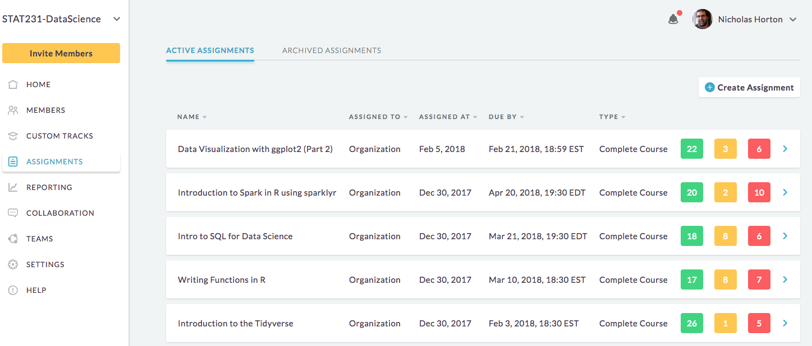

# Teaching Statistics and Data Science Using R and RStudio Workshop (SSC, June, 2018)

## Overview

#### Workshop on Teaching Modern Statistics and Data Science using R/RStudio 
#### Nicholas Horton, Amherst College

R is a freely available language and environment for statistical computing and graphics that has become popular in academia and in many industries. RStudio is a power interactive development environment (IDE) for R that can be access from the cloud.  This workshop will introduce participants to teaching applied statistics and data science courses using computing in an integrated way. The presenter has been using R and RStudio to teach statistics to undergraduates at all levels for the last decade and will share his approach and favorite examples. Topics will include workflow in the RStudio environment, providing novices with a powerful but manageable set of tools, simple data wrangling, data visualization, and basic statistical inference using R. 

Much of this "Less Volume, More Creativity" approach will be facilitated using the mosaic package. The workshop is designed to be accessible to those with little or no experience with R and is intended to provide participants with skills, examples, and resources that they can use in their own teaching.

## Logistics

### Laptops

You'll be working on your own laptops: please be sure to bring one and a power cord (we'll want to ensure that every pair of participants has a working laptop).

### Shared RStudio server

Registrants will access workshop materials using a shared space on RStudio.cloud.  Please be sure to set up an account prior to the workshop.

## Schedule

- 9:00-10:15am

  0. introduction and setup: please connect to the RStudio.cloud server ssc2018rstudio (see [cloud.md](mdfiles/cloud.md)) and survey [results](mdfiles/survey.md)
  1. apology: US centric datasets
  2. `mplot(HELPrct)`
  3. [R Markdown](https://prezi.com/vq6l5yqpnqma/intro-to-r-markdown-cvc-2015)
  4. [Less Volume](http://rstudio.calvin.edu:3939/ecots2018) tutorial and [LessVolume.Rmd](Less-Volume2018-06.Rmd) Rmd: `learnr::run_tutorial("introduction", package = "ggformula")` `learnr::run_tutorial("refining", package = "ggformula")`
  5. Working on day one: [TISE Paper](https://escholarship.org/uc/item/84v3774z) `mplot(XX)` and RPubs (username 'STAT135')
  6. [RQuiz study guide](quiz/R-guide.pdf)

- 10:15-10:30am break

- 10:30-noon
  1. autotrader.ca: please download https://nhorton.people.amherst.edu/cars.csv and scrape data (see instructions at cars.com/carshandout.pdf)
  2. An [overview](https://github.com/Amherst-Statistics/TeachingStatsDataScience2018-06/blob/master/SSC2018.pdf)
  3. dplyr + tidyverse: (see [why tidyverse](mdfiles/tidyverse.md)) https://dtkaplan.shinyapps.io/Five_data_verbs/#section-pipe-notation plus 
`dplyr-tutorial.Rmd` and `restaurants-example.Rmd`
  4. SQL: `sql-example1.Rmd` and `sql-example2.Rmd`
  5. R Style: [Google style guide](https://google.github.io/styleguide/Rguide.xml), [Hadley style guide](http://adv-r.had.co.nz/Style.html), Randy's [suggestions](mdfiles/style.md)
  6. Watch Hadley code: https://www.youtube.com/watch?v=go5Au01Jrvs&index=11&list=WL&t=0s
  7. Discussion: why RStudio?  See [here](mdfiles/rstudio.md)
  8. Discussion: how to teach this material?  See [here](mdfiles/teach.md)
  8. Q&A review

- noon-1:00pm lunch (see [suggestion](mdfiles/lunch.md))

- 1:00-2:15pm
  1. shiny `shiny.R`: please run the app then add another tab that displays summary statistics for the `displayenroll` variable by `subject`: `favstats(displayenroll ~ subject, data = courses())`
  2. Shiny gallery: https://shiny.rstudio.com/gallery/ and examples https://r.amherst.edu/apps/nhorton
  2. network analysis: `igraph1.Rmd` and `igraph2.Rmd`
  3. leaflet: `leaflet.Rmd`

- 2:15-2:30pm break

- 2:30-4:00pm 
  1. github: https://github.com/Amherst-Statistics/SSCtest   `github.Rmd`
  2. DataCamp: https://datacamp.com  

  3. learnr: https://rstudio.github.io/learnr/  (see `dplyr-tutorial.Rmd`)
  4. closing and all questions answered

- 3:30-3:45pm Closing thoughts, other resources, final review of Q&A document, and next steps

## Feedback

We’ll use this Google Doc to record your questions and comments and to provide responses. Feel free to edit it at anytime before, during, or (shortly) after the workshop.

- [Google Doc](https://docs.google.com/document/d/1D65bQS--pmj6Cu9VAkjvmlIGe-yk2d0xGZfRknkysrA/edit?usp=sharing)

## Resources

### Workshop related

- http://www.github.com/Amherst-Statistics/TeachingStatsDataScience2018-06 (this page)
- https://rstudio.cloud (RStudio cloud)
- http://nhorton.people.amherst.edu/rstudio (student resources for R)
- https://statprep.github.io/Workshops_2018/Tutorials/tutorials.html (StatPREP tutorials)
- https://www.rstudio.com/resources/cheatsheets/ (RStudio cheatsheet)
- http://nas.edu/EnvisioningDS (Envisioning Undergraduate Data Science Education consensus report)

### Textbooks

- http://mdsr-book.github.io/ (Modern Data Science with R)
- http://r4ds.had.co.nz/ (R for Data Science)
- http://nhorton.people.amherst.edu/r2/ (Using R for Data Management, Statistical Analysis, and Graphics)
- http://nhorton.people.amherst.edu/sasr2/ (SAS and R: Data Management, Statistical Analysis, and Graphics)

### Textbooks with illustrated examples in R

- https://cran.r-project.org/web/packages/mosaic/ (mosaic vignettes and textbooks)
- https://nhorton.people.amherst.edu/is4 (De Veaux, Velleman, and Bock Stats Intro Stats)
- https://nhorton.people.amherst.edu/sdm4 (De Veaux, Velleman, and Bock Stats Data and Models)
- https://nhorton.people.amherst.edu/ips6e (IPS 6th edition)

### General Stat Ed

- http://www.amstat.org/education/gaise/ (revised GAISE College report)
- https://arxiv.org/abs/1705.09530 (commentary on revised GAISE College report)
- http://www.amstat.org/education/resourcesforundergradteachers.cfm
- http://www.amstat.org/education/pdfs/Resources-for-Teaching-an-Intro-Stats-Course.pdf
- http://community.amstat.org/stats101/home (Stats 101 examples)
- http://causeweb.org (CAUSE)

### Thinking with Data

- http://amstat.tandfonline.com/doi/full/10.1080/00031305.2015.1094283 (Thinking with data)
- http://nhorton.people.amherst.edu/precursors (developing precursors to "Thinking with Data")

### Other datasets

- https://github.com/ropensci/weathercan
- https://github.com/ropensci/bikedata
- https://data.geotab.com/

### RStudio servers

- http://deanattali.com/2015/05/09/setup-rstudio-shiny-server-digital-ocean/
- https://www.causeweb.org/cause/ecots/ecots16/breakouts/7
- https://rstudio.cloud

Last updated June 3, 2018
