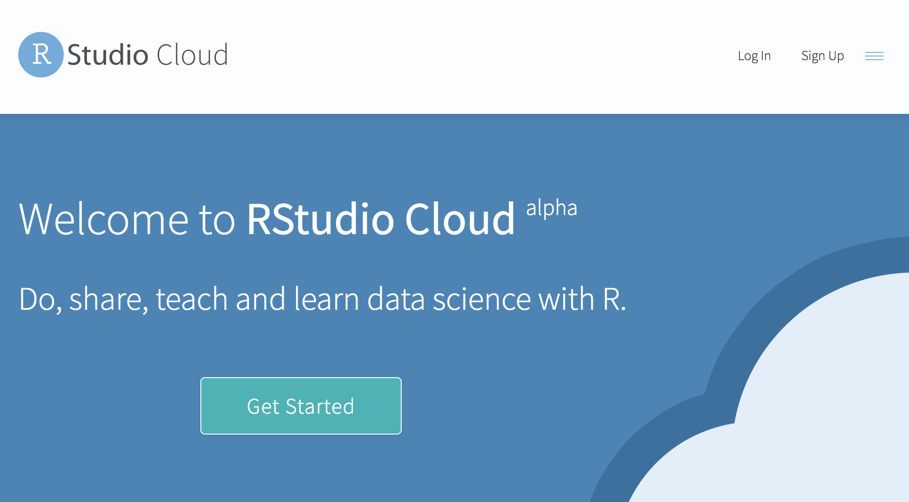
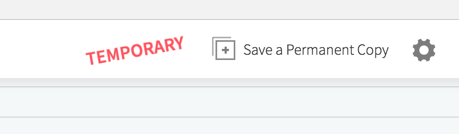

We will be using a shared RStudio.cloud server.  

Please use the link provided on the board to COPY my RStudio.cloud space.

You can use your Google or Github logins (or create a free account)

Be sure to click the `COPY` button make a permanent copy of your space (otherwise any changes you make will be ephemeral).

In the future to connect to your space you should log into `rstudio.cloud` (not the link I provided for initial setup).
